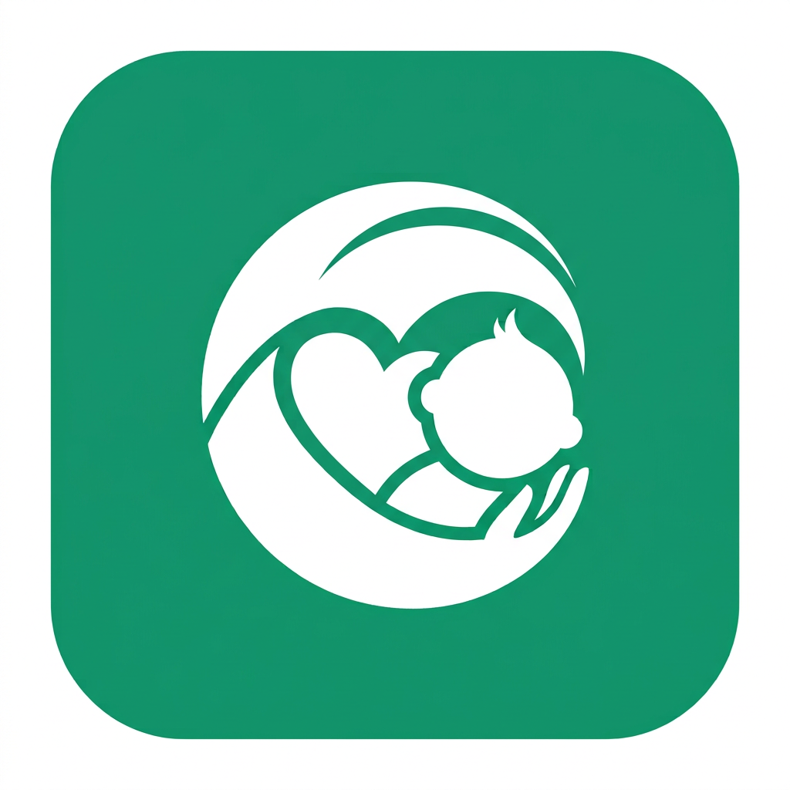

<div align="center">



# BébéCare

**Santé de l'enfant 0-5 ans, 15 pays de la CEDEAO.**
Carte des soins, assistant IA de triage, carnet vaccinal officiel,
dépistage de la malnutrition aux normes OMS et passerelle DHIS2.

🇬🇧 **[Read this in English → README.en.md](README.en.md)**

[Démo en ligne](https://bebecare.onrender.com) · GatewayHacks 2026 : Track 1 *Accessibility & Health* · Track *Momen*

</div>

---

## Le problème

En Afrique de l'Ouest, la plupart des décès d'enfants de moins de cinq ans sont
**évitables** : une dose de vaccin manquée, une malnutrition repérée trop tard,
une consultation retardée de trois jours.

Les données officielles OMS 2025 sont sans appel pour les pays couverts :

| Indicateur | Valeur |
|---|---|
| Couverture rougeole 1<sup>re</sup> dose, Bénin | **49 %** |
| Couverture rougeole 2<sup>e</sup> dose, Bénin | **23 %** |
| Pentavalent 3 doses, Bénin | 69 % |
| Mortalité des moins de 5 ans, Niger | **> 100 ‰** |
| Émaciation (enfants < 5 ans), Bénin | 8,3 % |

L'information qui sauverait ces enfants **existe déjà** : mais elle est enfermée
dans des PDF ministériels, des tableurs OMS et des bases DHIS2 auxquelles aucun
parent n'a accès.

## La solution

Une application web unique, **gratuite**, **utilisable sans compte**, en français
et en anglais, qui fonctionne sur un téléphone d'entrée de gamme.

| Module | Ce qu'il fait | Source officielle |
|---|---|---|
| 🗺️ **Carte des soins** | 23 568 structures de santé sur 15 pays, clustering vectoriel, « autour de moi », itinéraire, téléphone | OpenStreetMap (ODbL) |
| 🤖 **Assistant IA** | On décrit les symptômes en langage courant ; l'IA extrait âge, température, durée et signes, puis oriente | NLU maison + PCIME (OMS/UNICEF) |
| 💉 **Carnet vaccinal** | Calendrier **national réel** du pays, dates calculées, retards détectés, export agenda `.ics` | OMS/UNICEF : *Vaccine schedule* (WIISE) |
| ⚖️ **Dépistage nutrition** | Z-scores P/A, T/A, P/T + périmètre brachial, courbes de croissance | WHO Child Growth Standards (tables LMS) |
| 🩺 **Que faire ?** | Orientation urgence / consultation / surveillance, par questionnaire | Algorithme PCIME (OMS/UNICEF) |
| 📊 **Données & DHIS2** | Couverture vaccinale lue **en direct** dans DHIS2 + génération d'un payload `dataValueSets` conforme | DHIS2 API + OMS GHO (WUENIC) |
| 👤 **Compte** | Pays et langue mémorisés, suivi de plusieurs enfants, historique des mesures | SQLite, PBKDF2 240 000 itérations |

> **Le compte est un bonus, jamais un péage.** Tous les modules restent
> intégralement utilisables en mode invité. Se connecter ne sert qu'à
> synchroniser le suivi de l'enfant entre plusieurs appareils.

## L'assistant IA : architecture hybride en trois étages

L'assistant accepte une phrase libre, mal orthographiée, en français, en anglais
ou en français local, et la transforme en décision clinique traçable.

```
Phrase libre du parent
  |
  ETAGE 1 : COMPRENDRE ................ NLU local + modèle de langage
  |   NLU local  : lexique bilingue de 24 signes, correction orthographique par
  |                distance d'édition, détection de négation, extraction de
  |                l'âge, de la température, de la fréquence respiratoire
  |   LLM        : même tâche, mais contraint à un VOCABULAIRE FERMÉ de 24 codes
  |   Fusion     : union des deux, meilleure confiance retenue par signe
  |
  ETAGE 2 : DECIDER ................... algorithme PCIME (OMS/UNICEF)
  |   100 % déterministe. Aucun modèle de langage n'intervient ici.
  |   Sortie : rouge (urgence) / orange (consultation) / vert (surveillance)
  |
  ETAGE 3 : EXPLIQUER ................. modèle de langage
      Reformule les conseils DEJA décidés en langage simple.
      Il ne peut ni en ajouter, ni en retirer : la sortie est vérifiée.
```

### Les garde-fous, vérifiés par le code

| Risque | Garde-fou dans `api/llm.py` |
|---|---|
| Le LLM invente un signe clinique | Vocabulaire fermé : tout code hors des 24 est **supprimé** |
| Le LLM invente une mesure aberrante | Plages physiologiques : âge 0-60 mois, température 30-45 °C, FR 10-120/min |
| Le LLM change une recommandation | Le nombre de conseils doit être **identique** en sortie, sinon la reformulation est rejetée |
| Le LLM décide de l'urgence | Impossible : le niveau vient de `triage.py`, jamais de l'étage LLM |
| Le fournisseur tombe, quota dépassé, clé absente | Retour silencieux au NLU local. L'application n'est jamais bloquée |

Les conseils d'origine restent exposés dans `decision.conseils_source` : on peut
toujours comparer ce que l'OMS a décidé et ce que le modèle a reformulé.

### Coût et dépendances

Le LLM est **facultatif**. Sans clé d'API, l'assistant fonctionne exactement comme
avant, hors ligne, gratuitement. Avec une clé Groq ou Gemini (niveaux gratuits),
il comprend les phrases mal écrites et parle la langue du parent.

## Pourquoi DHIS2 change tout

DHIS2 est le système national d'information sanitaire de plus de 80 pays, dont
**14 des 15 pays couverts par BébéCare**. Aujourd'hui, un agent de santé
communautaire note les vaccinations sur papier, et quelqu'un les ressaisit dans
DHIS2 des semaines plus tard. BébéCare supprime cette double saisie :

1. **Lecture live** : les indicateurs de couverture (BCG, Penta 1/3, rougeole,
   VPO 3) sont lus en direct via l'API `analytics` de DHIS2, par district.
2. **Écriture conforme** : le carnet et le dépistage sont traduits en un document
   `dataValueSets` valide, prêt à être poussé dans le SNIS national.

BébéCare **ne se connecte à aucune base nationale de production** : la démonstration
tourne sur l'instance publique officielle de DHIS2 (base Sierra Leone, données
fictives, identifiants publiés par DHIS2). Un ministère n'a que trois variables
d'environnement à changer pour brancher BébéCare sur son propre DHIS2 : et
l'écriture reste désactivée (`BEBECARE_DHIS2_PUSH=0`) tant qu'il ne l'active pas.

## Architecture

```
api/                     FastAPI
  main.py                routes REST + service du front compilé
  donnees.py             chargement + index spatial en grille (0,25°)
  croissance.py          z-scores OMS (LMS de Cole, queues ajustées)
  triage.py              moteur PCIME déterministe (étage 2, la décision)
  ia_triage.py           NLU local + fusion avec l'étage LLM (étage 1)
  llm.py                 étage LLM optionnel : extraction et reformulation
  comptes.py             comptes, PBKDF2-HMAC-SHA256, jetons HMAC
  bd.py                  SQLite en local, PostgreSQL/Neon en ligne
  dhis2.py               passerelle DHIS2 (lecture, mapping, payload, validation)
  pays_meta.py           métadonnées des 15 pays
web/                     React 19 + Vite + MapLibre GL + Recharts
data/
  pays/*.json            23 568 structures de santé (15 fichiers)
  calendriers.json       calendriers vaccinaux nationaux OMS, 15 pays
  who_couverture.json    indicateurs WUENIC 2025
  who/croissance.json    tables LMS OMS (wfa, lhfa, wfl, wfh)
scripts/                 pipelines de collecte reproductibles
```

Les données de santé publique sont **statiques et chargées en mémoire** : aucune
requête lourde, démarrage en moins d'une seconde, hébergeable sur une instance
gratuite. Seuls les comptes utilisent une base (SQLite, un seul fichier).

### La carte

Tuiles **vectorielles** MapLibre GL servies par **OpenFreeMap** (sans clé, sans
quota, sans filigrane), clustering natif côté GPU, trois fonds de carte (Clair,
Sobre, Relief). Les points sont chargés par *bounding box* : le serveur ne renvoie
que ce qui est visible à l'écran.

## Démarrage local

```bash
# API
pip install -r api/requirements.txt
uvicorn api.main:app --reload --port 8000

# Front (autre terminal)
cd web && npm install && npm run dev
```

Le serveur de développement Vite proxifie `/api` vers le port 8000.
En production, `npm run build` puis FastAPI sert directement `web/dist`.

### Variables d'environnement

| Variable | Défaut | Rôle |
|---|---|---|
| `DATABASE_URL` | *(vide)* | PostgreSQL / Neon. Si absente : SQLite local |
| `BEBECARE_DB` | `data/bebecare.db` | Fichier SQLite, si pas de `DATABASE_URL` |
| `BEBECARE_SECRET` | *(aléatoire)* | Clé de signature des jetons de session |
| `BEBECARE_LLM_FOURNISSEUR` | `groq` | `groq`, `gemini` ou `off` |
| `BEBECARE_LLM_CLE` | *(vide)* | Clé d'API du LLM. Absente : NLU local seul |
| `BEBECARE_LLM_MODELE` | auto | Forcer un modèle précis |
| `BEBECARE_DHIS2_URL` | démo publique | Instance DHIS2 |
| `BEBECARE_DHIS2_AUTH` | `admin:district` | Identifiants DHIS2 |
| `BEBECARE_DHIS2_PUSH` | `0` | Autoriser l'écriture dans DHIS2 |

> Les comptes sont stockés dans **Neon** (PostgreSQL gratuit) en production : le
> disque de Render étant éphémère, une base externe est indispensable pour que les
> comptes survivent aux redéploiements. En local, sans `DATABASE_URL`, tout
> bascule automatiquement sur SQLite : rien à installer.

## Régénérer les données

```bash
python3 scripts/extract_osm.py        # structures de santé (Overpass / OSM)
python3 scripts/fetch_who.py          # couverture WUENIC (OMS GHO)
python3 scripts/fetch_who_growth.py   # tables LMS de croissance (OMS)
python3 scripts/build_calendriers.py  # calendriers vaccinaux nationaux (OMS)
```

Tous les pipelines sont **reproductibles** et n'utilisent que des sources
ouvertes et citables.

## Vie privée

- Aucun traceur, aucune publicité, aucune revente de données.
- **Sans compte** : les données de l'enfant restent dans le `localStorage` du
  téléphone et ne quittent jamais l'appareil.
- **Avec compte** : mot de passe haché en PBKDF2-HMAC-SHA256 (240 000 itérations),
  jeton de session signé HMAC-SHA256 valable 30 jours. Aucune donnée de santé
  n'est partagée avec un tiers.
- La géolocalisation n'est lue que sur appui explicite du bouton « Autour de moi ».

## Licences et attribution

| Donnée | Source | Licence |
|---|---|---|
| Structures de santé | © contributeurs OpenStreetMap | **ODbL 1.0** |
| Fonds de carte | OpenFreeMap · OpenMapTiles | ODbL / BSD |
| Couverture vaccinale | OMS/UNICEF WUENIC (GHO) | Données ouvertes OMS |
| Calendriers vaccinaux | OMS/UNICEF WIISE *Vaccine schedule* | Données ouvertes OMS |
| Normes de croissance | WHO Child Growth Standards 2006 | Données ouvertes OMS |
| DHIS2 | Instance de démonstration publique | Données fictives |

Aucune base de données nationale de production n'est interrogée.

## Auteur

Développé par **SOSSA Gninazé Mingnissê Darius**, infirmier diplômé d'État,
en master de puériculture et pédiatrie, développeur web full-stack, en première
année de formation en génie logiciel et intelligence artificielle. Il exerce à
**Cotonou (Bénin)**.

Les algorithmes cliniques ne viennent pas d'un tutoriel : ils viennent du terrain.

## Avertissement

BébéCare est un outil d'information et de dépistage. **Il ne pose aucun diagnostic
et ne remplace jamais l'avis d'un professionnel de santé.** En cas de doute ou
d'aggravation, consultez immédiatement un soignant.

---

## Documentation du projet

| Fichier | Contenu |
|---|---|
| `DEPLOIEMENT.md` | Mise en ligne pas à pas : Neon, Groq, GitHub, Render |
| `docs/MOMEN.md` | Construction de l'app compagnon no-code sur Momen |
| `docs/CHECKLIST_HACKATHON.md` | Règles, barème et pièges de GatewayHacks 2026 |
| `docs/DEVPOST.md` | Trame de la page de soumission |
| `docs/VIDEO.md` | Script de la vidéo de présentation |
| `README.en.md` | Cette présentation, en anglais |
